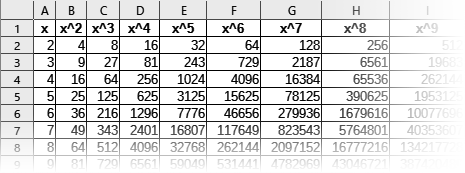

# WAVファイルを短くする

このPerlモジュールは .ods
([OpenDocument](https://ja.wikipedia.org/wiki/OpenDocument) Spreadsheet)
形式のファイルを読み込み、セル内容を配列で返します。



このような .ods ファイルから

    [
      [
        [ 'x', 'x^2', 'x^3', 'x^4', 'x^5', … ],
        [ '2', '4', '8', '16', '32', … ],
        [ '3', '9', '27', '81', '243', … ],
        [ '4', '16', '64', '256', '1024', … ],
        [ '5', '25', '125', '625', '3125', … ],
        …
      ]
    ]

という出力が得られます。

## プラットホーム

Windows、Linux の何れでも動作します。

## 使用方法

Perlプログラム内から

> @cell = @{&readOds(**ファイル**)};

と呼び出すと、

> $cell[**シート番号**][**行**][**列**]

にデータが取り込まれます。

**ファイル** は、ファイル名(パス名) か、ファイルハンドルを渡すことができます。

**シート番号**、**行**、**列** は、0から始まる整数となります。  
シート名は取り込まれません。

データ以外の情報(色、罫線、数式など)は取り込まれません。

セルが結合されているところは、その左上にのみデータが入り、
他のセルは未定義となります。

## 使用例

### (1)Linuxでファイル名を渡す例

```perl
#!/usr/bin/perl

  use strict;
  use warnings;
  use utf8;
  use readods;

  my (@cell);

  @cell = @{&readOds('subdir1/inventory.ods')};
```

### (2)Windowsでファイルハンドルを渡す例

```perl
  use strict;
  use warnings;
  use utf8;
  use Win32::LongPath;
  use readods;

  my ($fh, @cell);

  binmode STDOUT, ':crlf:encoding(cp932)';
  binmode STDERR, ':crlf:encoding(cp932)';
  binmode STDIN, ':crlf:encoding(cp932)';

  openL(\$fh, '<', '申し込み管理表.ods') or die;
  @cell = @{&readOds($fh)};
  close $fh;
```

Windowsでファイル名に漢字を含む場合など、
Win32::LongPath の力を借りることで
ファイルシステムの差異を吸収することができる。

